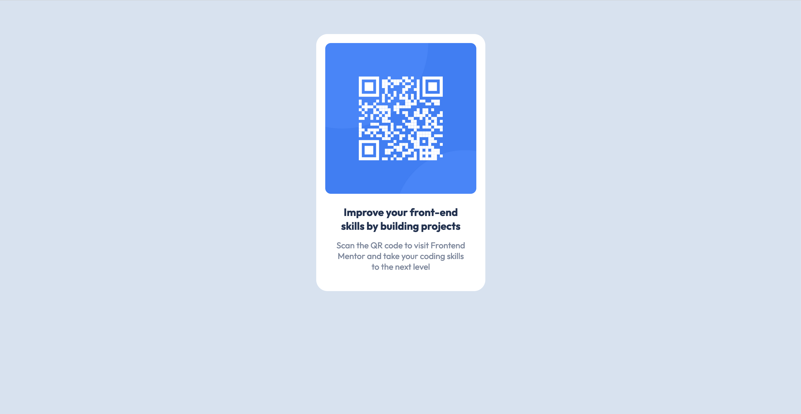

# Frontend Mentor - QR code component solution

This is a solution to the [QR code component challenge on Frontend Mentor](https://www.frontendmentor.io/challenges/qr-code-component-iux_sIO_H). Frontend Mentor challenges help you improve your coding skills by building realistic projects.

## Table of contents

- [Overview](#overview)
  - [Screenshot](#screenshot)
  - [Links](#links)
- [My process](#my-process)
  - [Built with](#built-with)
  - [What I learned](#what-i-learned)
- [Author](#author)

## Overview

### Screenshot



### Links

- Live Site URL: [Live site URL](https://dhayv.github.io/qr_html_css/)
- Solution URL: [Solution URL](https://www.frontendmentor.io/solutions/qr-code-rYMtmOYoZN)

## My process

I began by first integrating the Google Font by adding a stylesheet link to my index.html file. My next focus was to create the container that will hold the QR image and add the necessary background color.

Next, I started working on my stylesheet by:

--Setting the font family for the entire project.
Defining the background color for the body.
-Aligning the container's text and setting its border radius.
-Styling the ```<p>``` and ```<h3>``` elements with appropriate colors.

After that, I centered the container in the middle of the screen, inserted the image, and applied CSS styling to ensure the QR code looked as expected. The rest of the process involved fine-tuning the padding and margin for each CSS item to ensure the final output visually resembled the expected result.

### Built with

- Semantic HTML5 markup
- CSS custom properties
- CSS Grid
- Desktop-first workflow

### What I learned

I learned the importance of using min-height: 100vh; for a more responsive design. Here's an example of the CSS code I'm proud of:

```html
<h1>Some CSS code I'm proud of</h1>

```

```css
body {
    min-height: 100vh;
}

```

Using min-height: 100vh; ensures that the container expands to fit the content, providing better responsiveness compared to using height: 100vh;. This adjustment was crucial for ensuring the QR code container works well on both desktop and mobile devices.

## Author

<!-- - Website - [Add your name here](https://www.your-site.com) -->
- Frontend Mentor - [@hellomottoworld](https://www.frontendmentor.io/profile/hellomottoworld)
